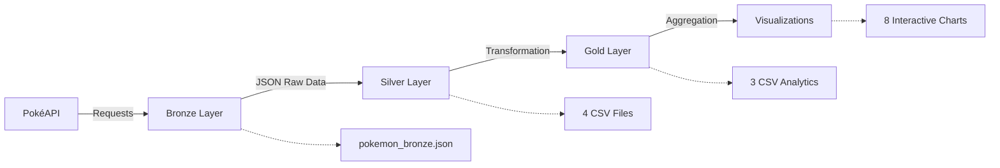

# 🎮 Pokémon ETL Pipeline con Arquitectura Medallion

<div align="center">


Pipeline ETL completo implementando la arquitectura **Medallion** (Bronze → Silver → Gold) para análisis exhaustivo de datos de Pokémon usando la [PokéAPI](https://pokeapi.co/).

[Características](#-características) • [Instalación](#-instalación) • [Uso](#-uso) • [Arquitectura](#-arquitectura-del-pipeline) • [Visualizaciones](#-visualizaciones)

</div>

---

## 📋 Tabla de Contenidos

- [Características](#-características)
- [Arquitectura del Pipeline](#-arquitectura-del-pipeline)
- [Requisitos](#-requisitos)
- [Instalación](#-instalación)
- [Uso](#-uso)
- [Estructura de Datos](#-estructura-de-datos)
- [Visualizaciones](#-visualizaciones)
- [Estructura del Proyecto](#-estructura-del-proyecto)
- [Ejemplos de Uso](#-ejemplos-de-uso)
- [Contribuir](#-contribuir)
- [Licencia](#-licencia)
- [Contacto](#-contacto)

---

## ✨ Características

### 🔹 Pipeline ETL Completo
- **Extracción automatizada** de datos desde PokéAPI
- **Transformación y limpieza** de datos con pandas
- **Agregaciones avanzadas** para análisis de negocio
- **Rate limiting** para respetar límites de la API
- **Manejo robusto de errores**

### 🔹 Arquitectura Medallion
- **🔵 Bronze Layer**: Datos raw sin procesar (JSON)
- **🔸 Silver Layer**: Datos limpios y normalizados (CSV)
- **🔶 Gold Layer**: Agregaciones listas para consumo (CSV)

### 🔹 Análisis y Visualización
- 8 visualizaciones interactivas con Plotly
- Análisis estadístico completo
- Correlaciones y patrones de datos
- Dashboards exportables

---

## 🏗️ Arquitectura del Pipeline



### 📊 Capas del Pipeline

#### 🔵 Bronze Layer (Extracción)
```python
BronzeLayer()
  ├── extract_pokemon_data(limit)
  ├── Rate limiting (0.1s entre requests)
  └── save_bronze() → pokemon_bronze.json
```

**Datos extraídos:**
- Información básica de Pokémon (id, nombre, altura, peso)
- Tipos (primario y secundario)
- Estadísticas base (HP, Ataque, Defensa, etc.)
- Habilidades (normales y ocultas)
- Experiencia base

#### 🔸 Silver Layer (Transformación)
```python
SilverLayer(bronze_data)
  ├── transform_pokemon_base()     → pokemon_silver_pokemon_base.csv
  ├── transform_pokemon_types()    → pokemon_silver_pokemon_types.csv
  ├── transform_pokemon_stats()    → pokemon_silver_pokemon_stats.csv
  └── transform_pokemon_abilities() → pokemon_silver_pokemon_abilities.csv
```

**Transformaciones aplicadas:**
- Normalización de unidades (altura en metros, peso en kg)
- Limpieza de nombres (capitalización consistente)
- Separación de datos en tablas relacionales
- Eliminación de datos innecesarios

#### 🔶 Gold Layer (Agregación)
```python
GoldLayer(silver_dfs)
  ├── create_pokemon_summary()  → Resumen completo con métricas
  ├── create_type_analysis()    → Análisis por tipo de Pokémon
  └── create_stats_pivot()      → Tabla pivote de estadísticas
```

**Métricas calculadas:**
- Total de estadísticas
- Promedio y máximo de stats
- Categorías de poder (Low, Medium, High, Elite)
- Categorías de tamaño (Small, Medium, Large)
- Agregaciones por tipo

---

## 💻 Requisitos

### Software Necesario
- Python 3.8 o superior
- pip (gestor de paquetes de Python)
- Jupyter Notebook o JupyterLab

### Dependencias

```txt
requests>=2.31.0
pandas>=2.1.4
plotly>=5.18.0
jupyter>=1.0.0
```

---

## 🚀 Instalación

### 1. Clonar el Repositorio

```bash
git clone https://github.com/jersonarrelucea14/pokemon-etl-pipeline.git
cd pokemon-etl-pipeline
```

### 2. Crear Entorno Virtual (Recomendado)

**En Windows:**
```bash
python -m venv venv
venv\Scripts\activate
```

**En macOS/Linux:**
```bash
python3 -m venv venv
source venv/bin/activate
```

### 3. Instalar Dependencias

```bash
pip install -r requirements.txt
```

### 4. Verificar Instalación

```bash
python -c "import requests, pandas, plotly; print('✅ Todo instalado correctamente')"
```

---

## 📖 Uso

### Opción 1: Jupyter Notebook

```bash
# Iniciar Jupyter Notebook
jupyter notebook

# Abrir el archivo
# Request_API_ETL_con_API_Pokemon_con_graficos.ipynb

# Ejecutar todas las celdas: Cell → Run All
```

### Opción 2: Ejecución Rápida

```python
# Importar y ejecutar el pipeline
from pokemon_etl import run_etl_pipeline

# Ejecutar con configuración por defecto (50 pokémon)
results = run_etl_pipeline(
    pokemon_limit=50,
    save_files=True,
    show_visualizations=True
)

# Acceder a los datos
bronze_data = results['bronze']
silver_dfs = results['silver']
gold_dfs = results['gold']
visualizations = results['visualizations']
```

### Opción 3: Personalización

```python
# Personalizar el número de Pokémon a analizar
results = run_etl_pipeline(
    pokemon_limit=150,  # Analizar primera generación completa
    save_files=True,
    show_visualizations=False
)

# Generar visualizaciones personalizadas
viz = results['visualizations']
fig = viz.create_radar_chart(pokemon_ids=[1, 4, 7])  # Bulbasaur, Charmander, Squirtle
fig.show()
```

---

## 📁 Estructura de Datos

### Archivos Generados

```
output/
├── bronze/
│   └── pokemon_bronze.json              # Datos raw de la API
├── silver/
│   ├── pokemon_silver_pokemon_base.csv  # Info básica (50 pokémon)
│   ├── pokemon_silver_pokemon_types.csv # Tipos (76 relaciones)
│   ├── pokemon_silver_pokemon_stats.csv # Stats (300 estadísticas)
│   └── pokemon_silver_pokemon_abilities.csv # Habilidades (120 relaciones)
└── gold/
    ├── pokemon_gold_pokemon_summary.csv # Resumen completo
    ├── pokemon_gold_type_analysis.csv   # Análisis por tipo
    └── pokemon_gold_stats_pivot.csv     # Tabla pivote
```

### Esquema de Datos

#### pokemon_summary (Gold)
| Campo | Tipo | Descripción |
|-------|------|-------------|
| pokemon_id | int | ID único del Pokémon |
| name | str | Nombre del Pokémon |
| height | float | Altura en metros |
| weight | float | Peso en kilogramos |
| base_experience | int | Experiencia base |
| types | str | Tipos (ej: "Fire / Flying") |
| total_stats | int | Suma de todas las estadísticas |
| avg_stat | float | Promedio de estadísticas |
| max_stat | int | Estadística más alta |
| abilities_count | int | Número de habilidades |
| size_category | str | Small / Medium / Large |
| power_level | str | Low / Medium / High / Elite |

---

## 📊 Visualizaciones

### 1. 🏆 Top 15 Pokémon por Estadísticas Totales
Gráfico de barras horizontal mostrando los Pokémon más poderosos.

<div align="center">
  
</div>

**Insights:**
- Identifica los Pokémon más fuertes
- Compara niveles de poder
- Visualiza distribución de stats

### 2. 📈 Distribución de Niveles de Poder
Histograma de estadísticas totales clasificadas por nivel.

<div align="center">
  
</div>

**Insights:**
- Distribución de poder en la muestra
- Identificación de outliers
- Patrones de balanceo

### 3. ⭐ Comparación de Estadísticas (Radar Chart)
Radar comparativo de los Top 5 Pokémon.

<div align="center">
  
</div>

**Insights:**
- Fortalezas y debilidades
- Perfiles de combate
- Especializaciones

### 4. 🎯 Análisis Completo por Tipo
4 subgráficos analizando tipos de Pokémon.

<div align="center">
  
</div>

**Insights:**
- Tipos más comunes
- Características físicas promedio por tipo
- Experiencia promedio por tipo

### 5. 🌍 Análisis 3D: Altura vs Peso vs Experiencia
Scatter plot 3D interactivo.

<div align="center">
  
</div>

**Insights:**
- Correlaciones multidimensionales
- Clustering de Pokémon similares
- Patrones de diseño

### 6. 🔥 Heatmap de Estadísticas
Mapa de calor de stats del Top 20.

<div align="center">
  
</div>

**Insights:**
- Comparación visual de múltiples stats
- Identificación de especializaciones
- Patrones de distribución

### 7. 🔗 Matriz de Correlación
Correlaciones entre características numéricas.

<div align="center">
  
</div>

**Insights:**
- Relaciones entre variables
- Factores predictivos
- Dependencias estadísticas

### 8. ☀️ Distribución por Categorías (Sunburst)
Gráfico jerárquico de tamaño y poder.

<div align="center">
  
</div>

**Insights:**
- Distribución por categorías
- Proporciones visuales
- Estructura de datos

---

## 🗂️ Estructura del Proyecto

```
pokemon-etl-pipeline/
│
├── Request_API_ETL_con_API_Pokemon_con_graficos.ipynb  # Notebook principal
├── README.md                                            # Este archivo
├── requirements.txt                                     # Dependencias
├── .gitignore                                          # Archivos ignorados
├── LICENSE                                             # Licencia MIT
│
├── docs/                                               # Documentación adicional
│   ├── architecture.md                                 # Arquitectura detallada
│   ├── data_dictionary.md                             # Diccionario de datos
│   └── examples.md                                    # Ejemplos de uso
│
├── images/                                            # Screenshots
│   ├── visualization_1.png
│   ├── visualization_2.png
│   └── ...
│
└── output/                                            # Archivos generados
    ├── bronze/
    ├── silver/
    └── gold/
```

---

## 💡 Ejemplos de Uso

### Análisis de una Generación Completa

```python
# Analizar la primera generación (151 pokémon)
results = run_etl_pipeline(
    pokemon_limit=151,
    save_files=True
)

# Obtener Pokémon más fuertes
top_pokemon = results['gold']['pokemon_summary'].nlargest(10, 'total_stats')
print(top_pokemon[['name', 'total_stats', 'types']])
```

### Análisis por Tipo Específico

```python
# Filtrar Pokémon de tipo Fuego
fire_pokemon = results['gold']['pokemon_summary'][
    results['gold']['pokemon_summary']['types'].str.contains('Fire')
]

print(f"Pokémon de Fuego: {len(fire_pokemon)}")
print(f"Stats promedio: {fire_pokemon['total_stats'].mean():.2f}")
```

### Exportar Visualizaciones

```python
# Guardar visualizaciones como HTML
viz = results['visualizations']

for name, fig in viz.figures.items():
    fig.write_html(f"output/viz_{name}.html")
    print(f"✅ Guardado: viz_{name}.html")
```

### Crear Reportes Personalizados

```python
import pandas as pd

# Crear reporte de tipos
type_summary = results['gold']['type_analysis']
type_summary.to_excel('reporte_tipos.xlsx', index=False)

# Crear reporte completo
with pd.ExcelWriter('reporte_pokemon.xlsx') as writer:
    results['gold']['pokemon_summary'].to_excel(writer, sheet_name='Resumen', index=False)
    results['gold']['type_analysis'].to_excel(writer, sheet_name='Por Tipo', index=False)
    results['gold']['stats_pivot'].to_excel(writer, sheet_name='Estadísticas', index=False)
```
---

## ❓ FAQ (Preguntas Frecuentes)

**P: ¿Cuánto tarda en ejecutarse el pipeline completo?**
R: Con 50 Pokémon, aproximadamente 8-10 segundos. Con 150, alrededor de 25-30 segundos.

**P: ¿Cómo puedo analizar más de 150 Pokémon?**
R: Modifica el parámetro `pokemon_limit` en la función `run_etl_pipeline()`.

**P: ¿El proyecto funciona con Python 3.7?**
R: Se recomienda Python 3.8+, pero puede funcionar con 3.7 con ajustes menores.

---

## 📄 Licencia

Este proyecto está bajo la Licencia MIT. Ver el archivo [LICENSE](LICENSE) para más detalles.

---
## 👤 Contacto

**Jerson Arrelucea**

- GitHub: [@jersonarrelucea14](https://github.com/jersonarrelucea14)
- LinkedIn: [Jerson Arrelucea](https://linkedin.com/in/jerson-arrelucea-arrelucea-051b20266)
- Email: jersonarrelucea14@gmail.com

## 🌟 Sígueme

<div align="center">

[](https://github.com/jersonarrelucea14)
[](https://linkedin.com/in/jerson-arrelucea-arrelucea-051b20266)
[](mailto:jersonarrelucea14@gmail.com)

</div>

---

## 🙏 Agradecimientos

- [PokéAPI](https://pokeapi.co/) - Por proporcionar la API gratuita
- [Plotly](https://plotly.com/) - Por las visualizaciones interactivas
- [Pandas](https://pandas.pydata.org/) - Por el procesamiento de datos
- Comunidad de Pokémon - Por la inspiración

---

<div align="center">

**⭐ Si te gustó este proyecto, dale una estrella en GitHub ⭐**

Hecho con ❤️ y ☕ por  [Jerson Arrelucea](https://linkedin.com/in/jerson-arrelucea-arrelucea-051b20266)

</div>
